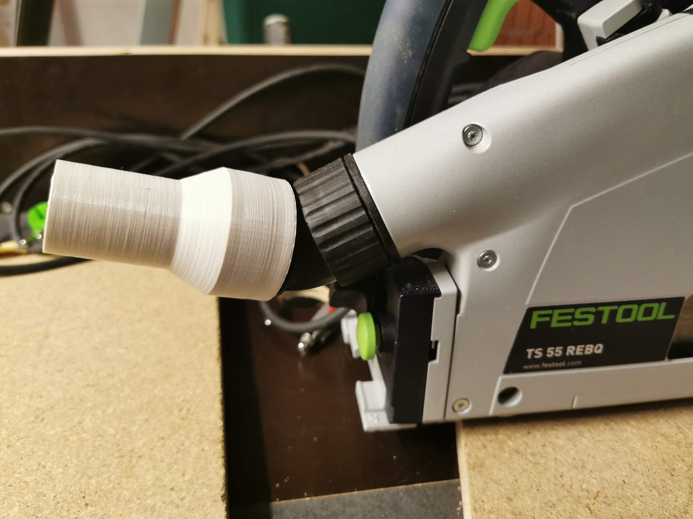

# Custom 3D Builds
Collection of my custom 3d builds: (s)cad files and some illustrative images

## kid-cave
I built a "cave top" for my kid's bed. These models are used to connect the top to the bed.

## drip-rail
In my workshop, a pipe close to a power outlet drips frequently (due to condensation). Although the power outlet is waterproof, I prefer bypassing the condensation drops.

## spice-caddy
Used to store baking stuff in a teabag caddy - wanted to have a larger one for the big spice (refill) bags, too.

## suction-adapter
Adapters to connect tools with the workshop suction. Worked nicely for my:
* Plunge saw:

## utils
Stuff I might want to reuse.

## third_party
Don't reinvent the wheel.

## woodwork
Some things need to be modelled precisely before building it in my makerspace - this is a collection of the corresponding CAD models.

## gardening
Anything that simplifies my gardening work, holds tools, connects stuff, etc.
* Plug holder for the electricity cable reel (the original one is crap since the plug falls out while reeling)

